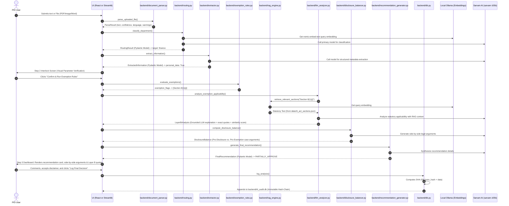

# ⚖️ RTI Intelligence System — PIO Dashboard (CHiPS)

A legally grounded decision support system designed to assist the Public Information Officer (PIO) at the Chhattisgarh Infotech Promotion Society (CHiPS) in routing, analyzing, and documenting decisions on Right to Information (RTI) applications under the RTI Act 2005.

The system employs a **5-Agent Hybrid Pipeline** leveraging local vector similarity retrieval (RAG) and adversarial balancing to provide legally defensible, explainable recommendations.

---

## 📐 Core Architecture & Legal Safeguards

1. **Human-in-the-Loop Interlock Gate**: The AI recommends, but the PIO decides. Parameters extracted in Step 2 must be verified by the PIO before exemption analysis executes. Decisions require explicit disclaimer signature.
2. **Immutable Audit Trail**: All queries, AI outputs, and PIO overrides are written to an append-only, SHA-256 hash-chained SQLite database (`backend/rti_audit.db`). This provides a legally verifiable defense record for Central Information Commission (CIC) proceedings.
3. **Adversarial Disclosure Balancing**: For every rejection recommended, the system forces a side-by-side display of the strongest legal case for disclosure vs. exemption, combating systemic "refuse-by-default" bias.
4. **Citation Grounding (RAG)**: The LLM is strictly prohibited from citing sections, cases, or external laws not present in the local retrieved legal corpus. Exact quotes are cited alongside cosine similarity scores.
5. **Hybrid LLM Architecture**: 
   - **Reasoning & Drafting**: Primary completion calls (classification, parameter extraction, statutory analysis, balancing, synthesis, and letter drafting) invoke the **Sarvam AI (`sarvam-105b`)** completions model via `backend/sarvam_client.py`.
   - **Local Semantic Retrieval**: Embeddings for local RAG query matching and department search similarity are computed locally using **Ollama** running **`nomic-embed-text`**.
   - **Local Heuristics Fallback**: If the Sarvam API is unreachable or the API key is not present, the system degrades gracefully to deterministic Python regex rules, keyword maps, and heuristics.
6. **Bilingual Document Export**: Generates official RTI response letters (via `backend/response_letter.py`) and detailed AI analysis reports (via `backend/export_report.py`) in Word (`.docx`) format, resolving character rendering failures and missing details.

---

## 📂 Project Structure

```
├── backend/
│   ├── main.py                      # FastAPI API server for the React web application
│   ├── db.py                        # SQLite immutable audit trail & SHA-256 hash-chaining
│   ├── ocr.py                       # PDF/Image text extraction & bilingual language detection
│   ├── routing.py                   # Agent 1: 3-Pass progressive Jurisdiction Classifier (Keyword + Vector + LLM)
│   ├── extractor.py                 # Agent 2: Information parameter extractor (Sarvam AI structured JSON)
│   ├── exemption_rules.py           # Agent 3 - Layer A: Hardcoded deterministic exemption rules
│   ├── llm_analyzer.py              # Agent 3 - Layer B: LLM statutory analyzer using local RAG context
│   ├── disclosure_balancer.py       # Agent 4: Adversarial disclosure balancer (Pro vs. Con)
│   ├── recommendation_generator.py  # Agent 5: Synthesis recommendation compiler (Approve/Reject/Transfer)
│   ├── response_letter.py           # Word (.docx) PIO response letter generator (bilingual, Mangal fallback)
│   ├── export_report.py             # Word (.docx) AI Analysis Report generator (failsafe font styling)
│   ├── document_parser.py           # Document text extraction (DOCX/PDF parsing)
│   ├── rag_engine.py                # Local RAG vector retriever (Ollama embeddings)
│   ├── legal_sections.py            # Statutory citation and cg-specific rule resolver
│   ├── audit_logger.py              # Centralized logging, file backups, and transaction history
│   ├── sarvam_client.py             # Centralized client for invoking Sarvam AI completions (sarvam-105b)
│   └── rti_audit.db                 # Active database file containing the audit chain
├── data/
│   ├── departments.json             # Function matrix mapping departments to jurisdictions
│   ├── dept_embeddings.json         # Precomputed dense embeddings for department functions
│   ├── legal_sections.json          # Cached statutory sections, definitions, and cg-specific rules
│   ├── rti_act_sections.json        # Section-aware chunked legal text of the RTI Act 2005
│   ├── rti_sections_embeddings.json # Cached dense embeddings of the legal chunks
│   └── sample_rtis.json             # Standardized scenarios used for pipeline benchmarks
├── frontend/
│   ├── app.py                       # Streamlit-based PIO Dashboard application
│   └── pages/
│       └── rti_reference.py         # Subpage for browsing reference laws and guidelines
├── frontend-react/
│   ├── src/
│   │   ├── App.tsx                  # Main React view controller and step machine
│   │   ├── components/              # Stepper, BalancerGrid, PIOLogForm, RecommendationCard components
│   │   └── index.css                # Base stylesheet with Tailwind tokens
│   ├── vite.config.ts               # Vite configuration and backend API proxy routing
│   └── package.json                 # Node package configuration
├── notebooks/
│   ├── verify_routing.py            # Unit test for Agent 1 classification accuracy
│   ├── verify_phase1.py             # Unit test for Agent 2 extraction and Layer A rules
│   ├── verify_phase2_3.py           # End-to-end pipeline test (Agents 1 through 5)
│   ├── test_ocr.py                  # Unit test for PDF/Image OCR and bilingual extraction
│   └── quick_test.py                # Quick database insertion & routing check
├── requirements.txt                 # Python project library dependencies
└── README.md                        # Documentation & setup instructions
```

---

## 📖 Story Flow: Tracing a Request's Journey Through the System

To understand how data flows and which file executes at each point, let's follow a sample RTI request through its lifecycle:

> **The Request**: *"Please provide the private medical files and bank details of employee Ramesh Kumar."*



### 1. Step 1: The Arrival & Extraction
*   **Action**: The PIO pastes the text or uploads a file (PDF/Image/Word Document) in the UI.
*   **Execution**: The UI calls `parse_uploaded_file` inside `backend/document_parser.py`. It automatically detects digital PDFs (bypassing heavy OCR), extracts text from Microsoft Word documents (`.docx`, `.doc`), runs pytesseract OCR on scanned documents/images, and returns text, confidence, language, and quality warnings.

### 2. Step 2: Jurisdiction Routing (Agent 1)
*   **Action**: The UI sends the text to `backend/routing.py`'s `classify_department` function.
*   **Execution**: The classifier queries Sarvam AI's primary model (`sarvam-105b`). If unavailable, it falls back to a local pipeline using keyword checks and `nomic-embed-text` cosine similarity queries via **Ollama** against `data/dept_embeddings.json`. It maps the query to **finance** and returns a `RoutingResult`.

### 3. Step 3: Parametric Extraction (Agent 2)
*   **Action**: The UI forwards the text to `backend/extractor.py`'s `extract_information` function.
*   **Execution**: A structured cloud LLM call to Sarvam AI (`sarvam-105b`) structured via JSON schema parses parameters, setting:
    *   `information_type: "employee"`
    *   `personal_data: True` (since Ramesh Kumar is an individual)
    *   `public_interest_override: False`
    *   It returns an `ExtractedInformation` Pydantic model (falling back to regex heuristics if offline).

### 4. Step 4: The Interlock Gate
*   **Action**: The UI halts and renders the extracted values on the screen.
*   **Execution**: The PIO reviews the inputs. If correct, the PIO clicks **Confirm & Run Exemption Rules**.

### 5. Step 6: Grounded RAG Analysis (Agent 3 - Layer B)
*   **Action**: The text and triggered rules are sent to `backend/llm_analyzer.py`'s `analyze_exemption_applicability`.
*   **Execution**: The module calls `backend/rag_engine.py`'s `retrieve_relevant_sections` to query `data/rti_act_sections.json` using local Ollama vector embeddings. The Sarvam AI LLM writes a reasoned justification grounded strictly in that text and returns a `LayerBAnalysis` model.

### 6. Step 7: Adversarial Balancing (Agent 4)
*   **Action**: The text and rule flags are sent to `backend/disclosure_balancer.py`'s `compute_disclosure_balance`.
*   **Execution**: The Sarvam AI LLM generates side-by-side case arguments:
    *   *Pro-Disclosure Case*: Highlights severing records under Section 10 and promoting public accountability.
    *   *Pro-Exemption Case*: Focuses on protecting personal coordinates and preventing unwarranted privacy invasion.
    *   It returns a `DisclosureBalance` object.

### 7. Step 8: Synthesis Recommendation (Agent 5)
*   **Action**: The routing result, confirmed extraction details, Layer B analysis, and disclosure balance are sent to `backend/recommendation_generator.py`'s `generate_final_recommendation`.
*   **Execution**: The synthesis agent compiles all details and calls Sarvam AI to output a unified `FinalRecommendation` model:
    *   `recommendation`: `PARTIALLY_APPROVE` (Redact personal files, disclose public records)
    *   `rejection_risk`: Detail on Section 20(1) penalties (Rs. 250/day up to Rs. 25,000) for wrongful rejection.
    *   `suggested_pio_action`: Timeline directive for partial release within 30 days.

### 9. Step 9: Interactive Decision & Cryptographic Signing
*   **Action**: The dashboard renders the final synthesized Recommendation Card, the adversarial columns, and Layer B RAG citations.
*   **Execution**: The PIO accepts the legal responsibility disclaimer, enters comments, and clicks **Log Final Decision**.
*   `backend/db.py`'s `log_analysis` instantiates an `AuditRecord`, fetches the preceding block's hash, computes the new SHA-256 hash chaining the previous hash to the current data, and appends the immutable row to `backend/rti_audit.db`.

---

## 🛠️ Prerequisites & Setup

### 1. Set Up Python Environment
Ensure Python 3.8+ (preferably Python 3.13) is installed. Install required libraries:
```powershell
pip install -r requirements.txt
```

### 2. Set Up Ollama Locally
The system requires a local Ollama server running to process embeddings and text synthesis.
1. Download and install Ollama from [ollama.com](https://ollama.com).
2. Start the Ollama local application.
3. Download the required models in your terminal:
   ```powershell
   ollama pull qwen2.5:3b
   ollama pull nomic-embed-text
   ```

---

## 🚀 Navigation: How to Run the Project

### 1. Run Verification Test Scripts
Before launching the UI, verify that the backend agents are configured correctly and the Ollama server is communicating:

- **Verify End-to-End Pipeline (Agents 1-5)**:
  Runs a sample personal data query and prints the detailed outputs of routing, extraction, Layer A, Layer B (RAG), balancer, and synthesis.
  ```powershell
  python notebooks/verify_phase2_3.py
  ```
- **Verify Jurisdiction Classifier (Agent 1)**:
  Benchmarks routing accuracy and bilingual parity across sample RTIs.
  ```powershell
  python notebooks/verify_routing.py
  ```
- **Verify Parameter Extractor & Rules (Phase 1)**:
  ```powershell
  python notebooks/verify_phase1.py
  ```

### 2. Launch the Streamlit PIO Dashboard
Run the dashboard server from the root directory:
```powershell
streamlit run frontend/app.py
```
*(If streamlit is not added to your system PATH but is installed in an Anaconda environment, execute:)*
```powershell
C:\Users\hp\anaconda3\Scripts\streamlit.exe run frontend/app.py
```

Open **`http://localhost:8502`** (or the port specified in your terminal output) in your web browser.

---

## 🖥️ Dashboard Features & User Guide

### 📥 New RTI Analysis
- **Step 1: Input & Routing**: Paste the text of the RTI or upload a PDF/Image. The system detects the language (Hindi/English), performs OCR, and automatically classifies the target department.
- **Step 2: Verification (Interlock)**: Review the AI-extracted parameters (IT systems, classifications, personal data flag). You *must* confirm or edit these coordinates before proceeding.
- **Step 3: Synthesis & Exemption Rules Evaluation**:
  - **Synthesized Action Card**: Displays the final recommendation (APPROVE / PARTIALLY_APPROVE / REJECT / TRANSFER) and suggested timelines.
  - **Deterministic Flags (Layer A)**: Cards showing triggered exemptions.
  - **Adversarial Columns**: Side-by-side case for disclosure vs. case for exemption.
  - **Grounded Statutory Quotes**: Reasoning from Layer B showing cosine similarity scores and exact quotes from the RTI Act.
  - **PIO Decision Entry**: Select your action, write overrides if applicable, check the legal responsibility box, and click **Log Final Decision** to chain the record.

### 📋 Audit Trail
- Displays the historical chain of all RTI applications, system recommendations, and final PIO actions.
- Each block is cryptographically chained to prevent manual alteration or deletion, serving as your legal defense record.

### 📊 System Status
- Displays real-time health checks of the local SQLite database, PDF parsers, and local Ollama model connections.

---

## 💻 Running the React + Vite Dashboard

The system includes a premium, non-conversational React + Vite + TypeScript dashboard which replaces the Streamlit UI, following the exact UI rules and step machines specified in the PIO guidelines.

### 1. Launch the FastAPI API Server (Backend)
Run the backend startup script from the root directory using the Anaconda Python environment:
```powershell
C:\Users\hp\anaconda3\python.exe scratch/start_backend.py
```
This script initializes the FastAPI gateway on **`http://localhost:8000`** containing the routes needed for the React frontend (`/api/ocr`, `/api/route`, `/api/extract`, `/api/evaluate_exemptions`, `/api/download_analysis`, `/api/download_response`, and `/api/log_decision`). Startup parameters and uvicorn logs are written to `scratch/backend_persistent.log`.

### 2. Launch the React Vite Frontend
Navigate to the `frontend-react` folder and run the development server:
1. **Install Dependencies**:
   ```bash
   cd frontend-react
   npm install
   ```
2. **Start Dev Server**:
   ```bash
   npm run dev
   ```
This starts the Vite dev server on **`http://localhost:3000`**. The Vite server is configured with a proxy mapping requests to `/api` directly to the FastAPI server running on port 8000.
