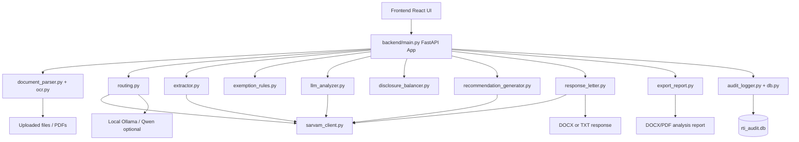
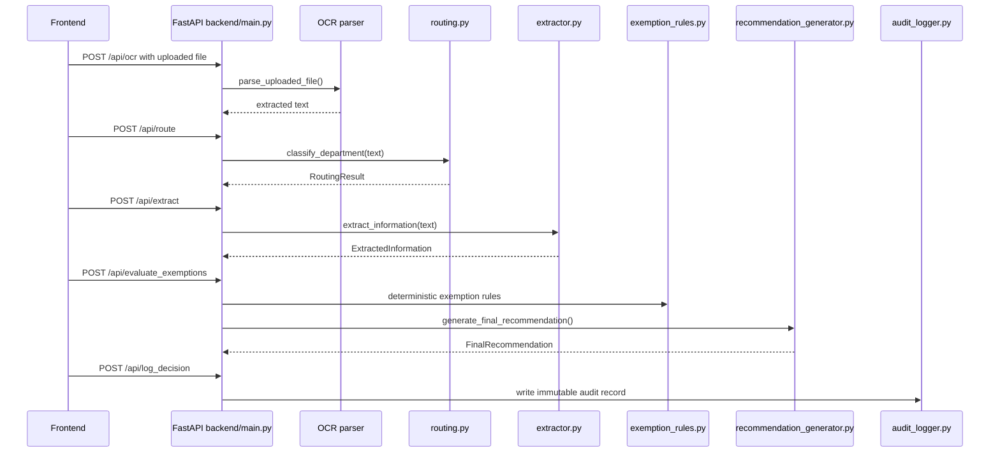

# Backend README

This folder contains the existing FastAPI backend for the MAM-RTI Decision Support System. It serves the current frontend, runs OCR and RTI analysis steps, generates draft replies and reports, and writes audit records.

The newer Phase 1 legal-retrieval modules live in `src/`. The backend can call them through thin adapter functions, but the existing backend endpoints remain unchanged.

## What This Folder Does

`backend/` is the application-facing API layer. It receives files and text from the UI, coordinates the original 5-agent RTI workflow, and exposes downloadable outputs.

Main responsibilities:

- Accept uploaded RTI documents and extract/OCR text.
- Route RTI applications to the likely department.
- Extract structured RTI metadata.
- Evaluate exemption rules and legal risks.
- Generate final PIO recommendations.
- Generate draft RTI replies and downloadable reports.
- Store audit decisions and preserve hash-chain integrity.
- Report system status for OCR, database, and local Ollama/Qwen availability.

## Backend Architecture Diagram



## Request Flow



## File Map

| File | Purpose |
| --- | --- |
| `main.py` | FastAPI application and API endpoints used by the frontend. |
| `document_parser.py` | Upload/document parsing wrapper used before OCR or text extraction. |
| `ocr.py` | OCR helpers for extracting text from uploaded document files. |
| `routing.py` | Existing department classification and routing logic. |
| `extractor.py` | Existing RTI information extraction module. |
| `exemption_rules.py` | Deterministic exemption checks and rule flags. |
| `llm_analyzer.py` | LLM-assisted exemption analysis. |
| `disclosure_balancer.py` | Balances disclosure and exemption arguments. |
| `recommendation_generator.py` | Existing final recommendation synthesis for the PIO. |
| `response_letter.py` | Existing official RTI response letter generation. Also exposes `generate_structured_legal_response()` for Phase 1 citation-aware outputs. |
| `export_report.py` | Downloadable analysis report generation. |
| `legal_sections.py` | Static legal-section reference data for API/UI display. |
| `rag_engine.py` | Existing lightweight RAG/statutory retrieval helper. |
| `sarvam_client.py` | Sarvam API client used by existing LLM-backed backend modules. |
| `audit_logger.py` | Audit logging helpers for decisions and generated outputs. |
| `db.py` | SQLite audit database models and persistence helpers. |
| `rti_audit.db` | Local SQLite audit database. |
| `requirements.txt` | Backend runtime dependencies. |
| `pyproject.toml` / `uv.lock` | Backend project metadata and lock data. |

## Important API Endpoints

| Endpoint | Method | Purpose |
| --- | --- | --- |
| `/api/health` | `GET` | Basic backend health check. |
| `/api/ocr` | `POST` | Extract text from uploaded document. |
| `/api/route` | `POST` | Detect department / routing recommendation. |
| `/api/extract` | `POST` | Extract structured RTI metadata. |
| `/api/evaluate_exemptions` | `POST` | Run exemption checks and final recommendation flow. |
| `/api/log_decision` | `POST` | Persist PIO decision and audit trail. |
| `/api/audit_trail` | `GET` | Return recent audit records and hash-chain status. |
| `/api/system_status` | `GET` | Check database, Ollama, and OCR status. |
| `/api/legal_sections` | `GET` | Return RTI legal-section reference data. |
| `/api/generate_draft` | `POST` | Generate existing draft response text. |
| `/api/download_analysis` | `POST` | Download analysis report. |
| `/api/download_response` | `POST` | Download official response letter. |

## How To Navigate

Start here when working on backend behavior:

1. `main.py`
   - Find the endpoint first.
   - Follow the imported function calls to the responsible module.

2. `routing.py`
   - Department recommendation and Section 6(3) transfer logic.

3. `extractor.py`
   - Structured RTI request metadata extraction.

4. `exemption_rules.py`, `llm_analyzer.py`, `disclosure_balancer.py`
   - Exemption analysis chain.

5. `recommendation_generator.py`
   - Existing final PIO recommendation model.

6. `response_letter.py`
   - Existing appellant-facing response letter generation.
   - New Phase 1 adapter: `generate_structured_legal_response(...)`.

7. `audit_logger.py` and `db.py`
   - Audit persistence and hash-chain validation.

## Phase 1 Integration Point

The Phase 1 legal retrieval pipeline lives in `src/`. Backend integration is intentionally light:

```python
from response_letter import generate_structured_legal_response

package = generate_structured_legal_response(
    analysis_result=rti_analysis_result,
    appellant_name="The Applicant",
    rti_date="2026-06-01",
    rti_subject="file notings",
)
```

This returns:

- `internal_note`
- `pio_recommendation`
- `draft_rti_reply`

The existing `generate_response_letter(session_state)` function is still available and unchanged for the current download flow.

## Run Backend

From project root:

```powershell
cd "C:\Users\hp\OneDrive\Desktop\major-rti\major rti"
backend\.venv\Scripts\python.exe -m fastapi dev backend\main.py
```

If using `uv` from inside `backend/`:

```powershell
cd "C:\Users\hp\OneDrive\Desktop\major-rti\major rti\backend"
uv run fastapi dev main.py
```

## Install Backend Dependencies

```powershell
cd "C:\Users\hp\OneDrive\Desktop\major-rti\major rti"
backend\.venv\Scripts\python.exe -m pip install -r backend\requirements.txt
```

For Phase 1 retrieval/indexing dependencies, also install the root requirements:

```powershell
backend\.venv\Scripts\python.exe -m pip install -r requirements.txt
```

## Local Model Notes

Existing backend modules use Sarvam in several places and also check local Ollama availability for some model-backed paths.

Common local model setup:

```powershell
ollama pull qwen2.5:3b
ollama pull qwen2.5:14b
ollama pull nomic-embed-text
```

Phase 1 modules use `QWEN_MODEL` or `OLLAMA_QWEN_MODEL` when calling local Qwen through Ollama.

## Logs And Data

| Path | Meaning |
| --- | --- |
| `backend/rti_audit.db` | Existing backend audit database. |
| `data/logs/pipeline.log` | Phase 1 indexing/query pipeline logs. |
| `data/logs/test_report.txt` | Integration test report. |
| `data/logs/extraction_errors.log` | Batch PDF extraction failures. |

## Safe Editing Rules

- Keep existing endpoints stable because the frontend depends on them.
- Add new API behavior as new functions or new endpoints.
- Do not remove `generate_response_letter()` unless the frontend is updated too.
- Keep `response_letter.py` backward compatible with existing session-state input.
- Prefer importing Phase 1 functionality from `src/` instead of duplicating retrieval or prompt logic in `backend/`.
