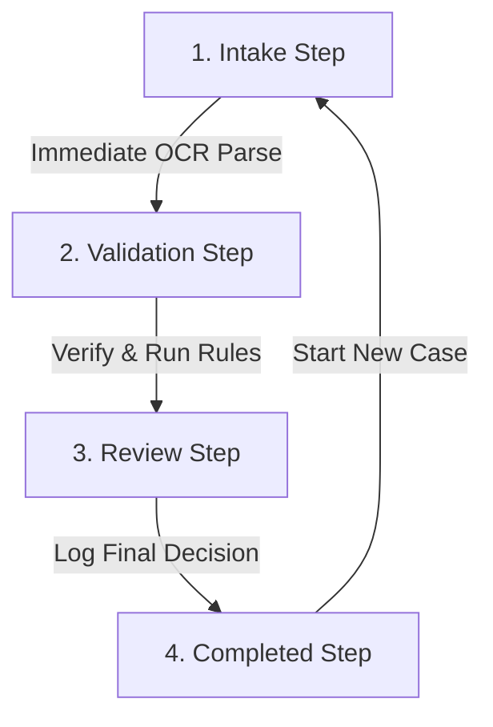

# 🖥️ RTI Intelligence System — React Workstation Frontend

Welcome to the React + Vite + TypeScript frontend dashboard for the **RTI Intelligence System**. This workspace is designed as a high-density, professional government compliance workstation (inspired by ServiceNow, eOffice, and SAP Fiori) for Public Information Officers (PIOs) processing high volumes of RTI cases daily.

This document provides a comprehensive guide to the interface layout, global controls, main workflow stages, supplementary views, and the state machine governing the frontend navigation.

---

## 🧭 Global Shell & Header Layout

The layout is split into two primary areas: a persistent top navigation bar and a dynamic view container.

### 1. Top Metadata Bar (30px high, Navy Blue)
Acts as the active case directory and utility bar:
*   **Case Coordinates:** Displays the active `Case ID` (e.g. `RTI/CHiPS/2026/...`), the `Compliance Deadline` (calculated automatically), and the active `Officer Name`.
*   **Theme Toggle (🌙/☀️):** A flat button on the far-right that toggles the global styling rules between Light and Dark mode. Theme preference is preserved in the application session.

### 2. Main Navigation Bar (72px high, White/Slate)
Handles high-level routing and branding:
*   **CHiPS Branding:** Houses the official **Chhattisgarh Infotech Promotion Society (CHiPS)** logo on the left. Sized at `52px` and placed on a clean background, it ensures the green and purple logo text remains fully readable.
*   **System Name:** `"RTI Intelligence System"`, separated from the logo by a vertical divider line.
*   **Tab Navigation:** Allows the officer to switch between three core modules:
    1.  **New Analysis:** The core intake and decision synthesis wizard.
    2.  **RTI Act:** The statutory lookup reference database.
    3.  **Audit Trail:** The cryptographic hash-chained transaction log.
*   **+ New Case Button:** Located on the far-right. Instantly clears the active case state, generates a fresh unique Case ID, and returns the workspace to the Intake screen.

---

## 🔄 Core Step Wizard Navigation ("New Analysis" Tab)

When the **New Analysis** tab is active, the workspace navigates through a **4-stage progressive intake wizard** managed by a central state machine. The stage indicator is rendered as a compact workflow breadcrumb (`[1 Intake] ➔ [2 Validation] ➔ [3 Review]`) at the top of the workspace.



### Stage 1: Case Registration (`InputStep.tsx`)
*   **Layout:** High-density two-column layout.
    *   **Left Column (60%):** Application document dropzone (supports PDF, DOCX, DOC, PNG, JPG, JPEG, TIFF, BMP).
    *   **Right Column (40%):** Text reader and manual input textarea.
*   **Execution Flow:**
    1.  Dropping or choosing a file immediately triggers a background OCR/parsing network request.
    2.  The dropzone displays an active progress spinner (`Extracting text...`).
    3.  Once loaded, a **document metadata row** (Source format, Language, and OCR Confidence score) is rendered inside the card.
*   **Quality Gates & Blocker Alerts:**
    *   If the parser returns warnings (e.g. scanned PDF but Tesseract is not available) or the confidence score is below **`85%`**, a warning banner is displayed along with a red blocker message.
    *   The right-side textarea is unlocked so the officer can manually paste or correct the text. For high-confidence digital files, this area remains read-only for verification.
    *   Clicking **Process RTI Application** triggers the routing and extraction agents.

### Stage 2: Parametric Verification (`ReviewStep.tsx`)
*   **Purpose:** The visual **Human-in-the-Loop Interlock Gate**. Before the heavy RAG and exemption rules run, the officer must verify the AI's parsed extraction fields.
*   **Layout:** Two side-by-side cards:
    *   **Left Card (Routing):** Shows the *Primary Department* routing classification. Provides a green `"Confirm AI Routing"` button and an amber `"Override Department"` option (which opens a manual select dropdown and reason field).
    *   **Right Card (Extracted Parameters):** Displays classification type (e.g., `citizen_data`, `procurement`), entities, IT systems, procurement status, and privacy flags.
*   **Transition:** Once verified, clicking `"Continue to Exemption Analysis"` launches a full-screen loading overlay (`Running Statutory Exemption Analysis...`) while Agent 3 (RAG statutory lookup) and Agent 4 (disclosure balancer) execute.

### Stage 3: Statutory Review (`ExemptionStep.tsx`)
*   **Layout:** High-focus, single-column workspace. The left column compliance banner is hidden to maximize focus on legal synthesis.
*   **Component Stacking Flow (Top to Bottom):**
    1.  **Advisory Action Assessment Card:** Displays the synthesized decision recommendation (`APPROVE`, `PARTIALLY_APPROVE`, `REJECT`, `TRANSFER`) along with a color-coded status badge and a scrollable box containing the application text.
    2.  **Statutory Exemption Accordions:** Four collapsible headers containing the legal arguments:
        *   *Applicable Exemption Sections:* Renders deterministic flags triggered by the rules engine (e.g., Section 8(1)(j)).
        *   *Statutory References (RAG matches):* Displays grounding texts, cosine similarity scores, and exact blockquote citations.
        *   *Disclosure & Exemption Balance:* Side-by-side arguments for and against disclosure with key balancing factors.
        *   *Draft Order Sheet:* Renders an AI-generated draft response letter (via Sarvam AI) matching the recommended action.
    3.  **Officer Decision Panel:** A sticky panel containing input controls for the final decision, override department select, final order sheet comments, and the legal responsibility declaration.
*   **Transition:** Checking the disclaimer and clicking `"Log Final Decision"` registers the transaction to the database.

### Stage 4: Case Registry Confirmation (`CompletedStep.tsx`)
*   **Purpose:** Renders the transaction confirmation.
*   **Details Displayed:**
    *   **Case ID & Timestamp:** Confirms the logged registry.
    *   **Cryptographic Verification:** Displays the **immutability ledger checkmark** (`Block Chained Successfully`) along with the unique SHA-256 block hash for this transaction.
    *   **Word Document Downloads:** Two action buttons (**"Analysis Report"** and **"Response Doc"**) generate and stream official Word (`.docx`) files. The buttons change to a disabled `"Generating..."` state with a spinner during generation to prevent duplicate requests.
*   **Transition:** Clicking `"Process Another Case"` clears the stage machine and resets the dashboard.

---

## 📂 Supplementary Views

Switching tabs in the main navigation header mounts supplementary pages:

### 1. RTI Act Module (`RTIReferenceView.tsx`)
*   Provides an interactive reference library of the RTI Act 2005.
*   Renders legal clauses, exemption criteria, Chhattisgarh State Rules, and fee/timeline structures in clean, high-density grids.

### 2. Cryptographic Ledger (`AuditTrailView.tsx`)
*   Allows the officer to view the complete history of logged decisions.
*   Features:
    *   **Ledger Status Bar:** Confirms the integrity of the SHA-256 hash-chain across all recorded entries.
    *   **Search Bar:** Filters records instantly (case-insensitive) across case ID, reasoning notes, and entities.
    *   **Filters Panel:** Filters by department, PIO action taken, and confidence level.
    *   **Export Actions:** Allows downloading the filtered ledger database directly as a CSV spreadsheet.

### 3. Diagnostics Panel (`SystemStatusView.tsx`)
*   Provides diagnostic indicators for system health.
*   Displays connection statuses and loaded models for:
    *   **SQLite Audit Database** (connection status, file path, record counts).
    *   **Ollama Embeddings Server** (model tags, tags list, reachability).
    *   **OCR Parser Libraries** (pdfplumber availability, pytesseract presence).

---

## ⚙️ Navigation State Machine (`App.tsx`)

The navigation and analysis wizard stages are controlled via a central React state machine utilizing a `useReducer` hook inside [src/App.tsx](file:///c:/Users/hp/projects/rti-project/offline/rti/frontend-react/src/App.tsx).

### Active State Structure
```typescript
interface AppState {
  activeTab: 'new_analysis' | 'rti_act' | 'audit_trail';
  analysisStage: 'input' | 'review_extraction' | 'exemption_analysis' | 'completed';
  caseId: string;
  rawText: string;
  language: string;
  ocrResult: OCRResult | null;
  routingResult: RoutingResult | null;
  extractedInfo: ExtractedInformation | null;
  evaluationResult: EvaluationResult | null;
  loggedRecord: AuditRecord | null;
}
```

### Action Reducers
*   `START_ANALYSIS`: Sets the extracted text, detected language, and moves `analysisStage` to `'review_extraction'`.
*   `CONFIRM_PARAMETERS`: Sets the verified parameters and updates `analysisStage` to `'exemption_analysis'`.
*   `LOG_DECISION`: Captures the PIO's override notes and final decision, sets `analysisStage` to `'completed'`, and writes the record to the audit chain.
*   `RESET_CASE`: Resets the stage back to `'input'`, clears all cached parameters, and generates a fresh Case ID.
