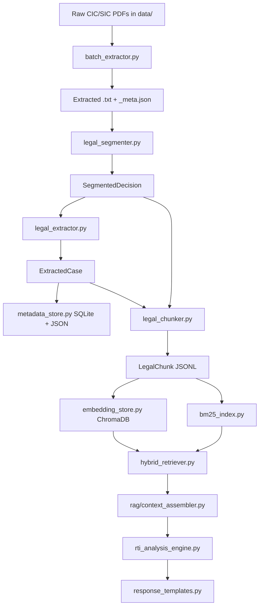
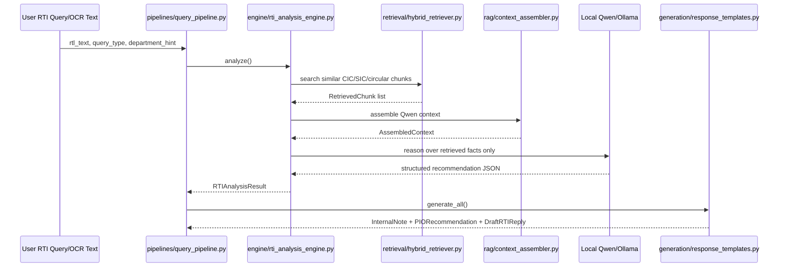
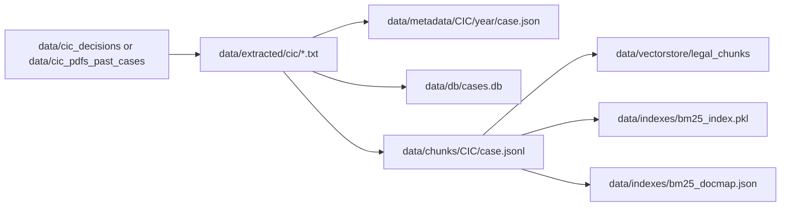

# Source Pipeline README

This folder contains the Phase 1 legal retrieval and RTI analysis pipeline for MAM-RTI. It is separate from the existing backend so the current frontend and API can keep working while the legal corpus indexing and citation-aware analysis layer grows.

The code in `src/` is local-only. It uses existing CIC/SIC/circular data under `data/`, local SQLite/JSON storage, local BM25, local ChromaDB embeddings, and local Qwen through Ollama where enabled.

## What This Folder Does

`src/` adds the legal-retrieval stack:

- Extract text from CIC/SIC decision PDFs.
- Segment legal decisions into meaningful legal sections.
- Extract structured legal metadata.
- Store case metadata in SQLite and JSON.
- Convert decisions into legal-aware retrieval chunks.
- Build BM25 and embedding indexes.
- Run hybrid retrieval over legal chunks.
- Assemble retrieved precedent context for Qwen.
- Run RTI analysis using retrieval as the factual layer.
- Generate citation-aware internal notes, PIO recommendations, and draft replies.
- Provide orchestration scripts for indexing and query-time execution.

## High-Level Architecture



## Runtime Query Flow



## Folder Map

| Folder | Purpose |
| --- | --- |
| `models/` | Shared Pydantic models. |
| `pipeline/` | Document processing and legal chunk creation steps. |
| `storage/` | Local metadata persistence. |
| `retrieval/` | BM25, Chroma embedding store, and hybrid retrieval. |
| `rag/` | Qwen context assembly for retrieved legal precedents. |
| `engine/` | End-to-end RTI analysis orchestration. |
| `generation/` | Citation-aware response package generation. |
| `pipelines/` | CLI/application orchestrators for indexing and query flow. |

## File Map

### `models/`

| File | Purpose |
| --- | --- |
| `extracted_case.py` | `ExtractedCase` Pydantic model for structured CIC/SIC case metadata. |

### `pipeline/`

| File | Purpose |
| --- | --- |
| `batch_extractor.py` | Extracts clean text from PDFs into `.txt` and `_meta.json` files. Uses PyMuPDF and skips already processed files. |
| `legal_segmenter.py` | Rule-based legal section segmentation into `HEADER`, `PARTIES`, `COMMISSION_FINDINGS`, `DIRECTIONS`, and other sections. |
| `legal_extractor.py` | Extracts case metadata from segmented decisions using regex and optional local Qwen. |
| `legal_chunker.py` | Creates legal section-aware `LegalChunk` objects and writes JSONL files under `data/chunks/`. |

### `storage/`

| File | Purpose |
| --- | --- |
| `metadata_store.py` | Stores `ExtractedCase` records in `data/db/cases.db` and JSON sidecars in `data/metadata/`. |

### `retrieval/`

| File | Purpose |
| --- | --- |
| `bm25_index.py` | Builds and searches the local BM25 keyword index from legal chunk JSONL files. |
| `embedding_store.py` | Generates CPU-compatible sentence-transformer embeddings and stores them in local ChromaDB. |
| `hybrid_retriever.py` | Combines BM25 and vector results with Reciprocal Rank Fusion. |
| `context_assembler.py` | Earlier retrieval-context assembler. Current query flow uses `rag/context_assembler.py`. |

### `rag/`

| File | Purpose |
| --- | --- |
| `context_assembler.py` | Builds a bounded 6000-token Qwen prompt from retrieved CIC/SIC chunks. |

### `engine/`

| File | Purpose |
| --- | --- |
| `rti_analysis_engine.py` | Coordinates department detection, retrieval, context assembly, Qwen reasoning, and `RTIAnalysisResult` creation. |

### `generation/`

| File | Purpose |
| --- | --- |
| `response_templates.py` | Generates `InternalNote`, `PIORecommendation`, and `DraftRTIReply` from `RTIAnalysisResult`. |

### `pipelines/`

| File | Purpose |
| --- | --- |
| `index_pipeline.py` | Run-once indexing orchestrator for raw PDFs to metadata, chunks, embeddings, and BM25. |
| `query_pipeline.py` | Per-request orchestrator that returns `{analysis, responses}`. |

## Data Products



| Path | Created By | Purpose |
| --- | --- | --- |
| `data/extracted/cic/` | `batch_extractor.py` / `index_pipeline.py` | Extracted text and extraction metadata. |
| `data/extracted/sic/` | `batch_extractor.py` / `index_pipeline.py` | Extracted SIC text and extraction metadata. |
| `data/db/cases.db` | `metadata_store.py` | Searchable SQLite case metadata. |
| `data/metadata/` | `metadata_store.py` | Human-readable JSON case metadata backup. |
| `data/chunks/` | `legal_chunker.py` | Legal chunk JSONL files. |
| `data/vectorstore/legal_chunks/` | `embedding_store.py` | Local ChromaDB vector store. |
| `data/indexes/bm25_index.pkl` | `bm25_index.py` | Pickled BM25 keyword index. |
| `data/indexes/bm25_docmap.json` | `bm25_index.py` | BM25 chunk metadata map. |
| `data/logs/pipeline.log` | `index_pipeline.py` / `query_pipeline.py` | Pipeline progress and errors. |
| `data/logs/test_report.txt` | `tests/test_integration.py` | Integration test report. |

## How To Navigate

Use this guide depending on the task:

| Task | Start Here | Then Check |
| --- | --- | --- |
| Process raw PDFs | `pipelines/index_pipeline.py` | `pipeline/batch_extractor.py`, `pipeline/legal_segmenter.py`, `pipeline/legal_extractor.py` |
| Fix text extraction | `pipeline/batch_extractor.py` | PyMuPDF extraction and metadata writing |
| Fix section parsing | `pipeline/legal_segmenter.py` | Boundary regex patterns and fallback logic |
| Fix legal metadata extraction | `pipeline/legal_extractor.py` | Regex patterns and Qwen prompt |
| Fix chunk creation | `pipeline/legal_chunker.py` | Section-to-chunk mapping and long section split |
| Fix metadata storage | `storage/metadata_store.py` | SQLite schema and JSON sidecars |
| Fix keyword search | `retrieval/bm25_index.py` | `legal_tokenize()` and filter logic |
| Fix semantic search | `retrieval/embedding_store.py` | Chroma collection and embedding model |
| Fix hybrid ranking | `retrieval/hybrid_retriever.py` | RRF merge and fallback paths |
| Fix Qwen prompt context | `rag/context_assembler.py` | Token budget and source formatting |
| Fix end-to-end analysis | `engine/rti_analysis_engine.py` | Retrieval, Qwen, source citation guardrails |
| Fix response outputs | `generation/response_templates.py` | Internal note, recommendation, draft reply templates |
| Add backend integration | `pipelines/query_pipeline.py` | Existing `backend/main.py` or `backend/response_letter.py` |

## Indexing Pipeline

The indexing pipeline is used to process the legal corpus before query-time analysis.

### Regex-only bulk indexing

Use this for fast CPU-only indexing:

```powershell
cd "C:\Users\hp\OneDrive\Desktop\major-rti\major rti"
backend\.venv\Scripts\python.exe src\pipelines\index_pipeline.py --source data\cic_pdfs_past_cases --mode regex-only
```

If your CIC folder is named exactly as planned:

```powershell
backend\.venv\Scripts\python.exe src\pipelines\index_pipeline.py --source data\cic_decisions --mode regex-only
```

### LLM-assisted indexing

Use only when local Qwen/Ollama is ready and you accept slower processing:

```powershell
backend\.venv\Scripts\python.exe src\pipelines\index_pipeline.py --source data\sic\pdf --mode llm
```

### Rebuild BM25 only

```powershell
backend\.venv\Scripts\python.exe src\pipelines\index_pipeline.py --rebuild-index
```

## Query Pipeline

The query pipeline is used per user request.

```powershell
backend\.venv\Scripts\python.exe src\pipelines\query_pipeline.py --text "Please provide file notings. If denied under Section 8(1)(j), provide reasons." --type exemption_check --department-hint "Revenue Department"
```

The output contains:

- `analysis`: `RTIAnalysisResult`
- `responses.internal_note`: PIO-only note
- `responses.pio_recommendation`: structured recommendation
- `responses.draft_rti_reply`: appellant-facing draft reply

## Backend API Integration Pattern

Add a new endpoint in the existing backend only when you are ready to expose the Phase 1 query flow:

```python
from pydantic import BaseModel
from pipelines.query_pipeline import QueryPipeline

query_pipeline = QueryPipeline()

class AnalyzeRequest(BaseModel):
    text: str
    type: str = "pio_check"
    department_hint: str | None = None

@app.post("/analyze")
async def analyze(req: AnalyzeRequest):
    return query_pipeline.run(
        rtl_text=req.text,
        query_type=req.type,
        department_hint=req.department_hint,
    )
```

This does not change any current `/api/...` endpoints.

## Tests

Integration tests are in `tests/test_integration.py`.

Fast CPU-only run:

```powershell
backend\.venv\Scripts\python.exe -m pytest tests\test_integration.py -v --no-llm
```

If the corpus folder is `data/cic_pdfs_past_cases` instead of `data/cic_decisions`:

```powershell
$env:CIC_DECISIONS_DIR="data/cic_pdfs_past_cases"
backend\.venv\Scripts\python.exe -m pytest tests\test_integration.py -v --no-llm
```

## Dependencies

Root `requirements.txt` covers the Phase 1 modules:

```text
pydantic
tqdm
PyMuPDF
ollama
rank_bm25
chromadb
sentence-transformers
pytest
```

Install from project root:

```powershell
backend\.venv\Scripts\python.exe -m pip install -r requirements.txt
```

## Local Model Notes

For regex-only indexing and `--no-llm` tests, Qwen is not required.

For LLM-assisted extraction or full Qwen reasoning:

```powershell
ollama pull qwen2.5:14b
```

The model name can be overridden:

```powershell
$env:QWEN_MODEL="qwen2.5:14b"
```

## Important Constraints

- Do not replace existing backend modules.
- Keep `src/` orchestration thin: import and call existing modules.
- Use regex-only mode for fast bulk indexing unless LLM quality is required.
- Keep all storage local: SQLite, JSON, ChromaDB, pickle.
- Retrieval facts must come from indexed CIC/SIC/circular chunks.
- Qwen is only the reasoning layer, not the source of facts.

## Troubleshooting

### `pytest` not found

Install root requirements:

```powershell
backend\.venv\Scripts\python.exe -m pip install -r requirements.txt
```

### `data/cic_decisions` not found

This checkout may use `data/cic_pdfs_past_cases`:

```powershell
$env:CIC_DECISIONS_DIR="data/cic_pdfs_past_cases"
```

### Chroma or sentence-transformers import errors

Install root requirements. These are needed for semantic retrieval:

```powershell
backend\.venv\Scripts\python.exe -m pip install chromadb sentence-transformers
```

### Slow indexing

Use regex-only mode:

```powershell
backend\.venv\Scripts\python.exe src\pipelines\index_pipeline.py --source data\cic_pdfs_past_cases --mode regex-only
```

### No retrieval results

Rebuild BM25 after chunk generation:

```powershell
backend\.venv\Scripts\python.exe src\pipelines\index_pipeline.py --rebuild-index
```
